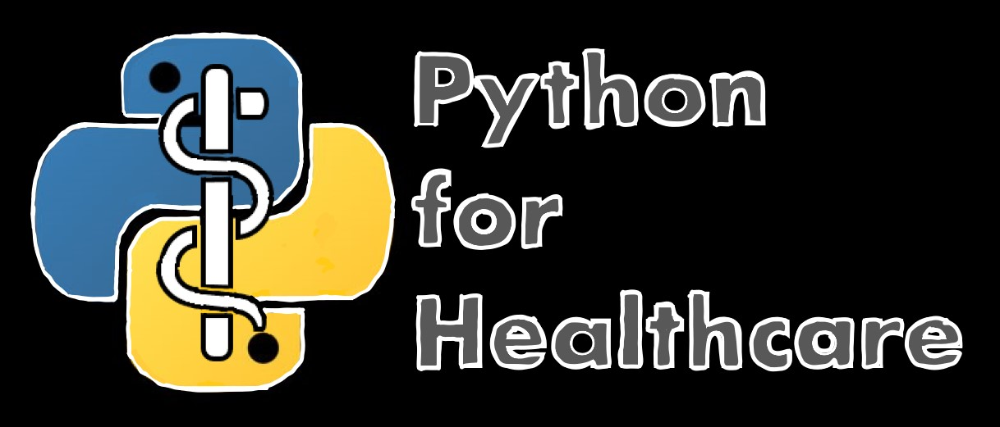

# Welcome to Python for Healthcare!
The Python for Health Care (Py4HC) project is a collection of open-source materials designed to teach future or current health care professionals how to use the Python programming language for data science in their field. The teaching content uses real-world publicaly accessible data pertaining to important questions in different components of health care delivery. The learning materials start with programming baiscs and end with building simple neural networks. While this course does not focus on the statistics and the math behind these tools, it is assumed that students have some familiarity with basic statistics.

## Learning theory in Py4HC
The learning materials in this repository are based on *constructivist learning theory*. This approach focuses on the students learning through their own application of the concepts for their own purpose. The content is designed to help students understand how they can use Python and Data Science for questions in their own current or future profession in health care delivery. Students will need to consider what they would like to do in the future and how these tools relate to their future goals. 
 
Py4HC pulls on concepts in literature, music, and other disciplines in the humanities so that students can pull on different backgrounds to approach learning Python. It also attempts to integrate creativity and abstract thinking into the learning process in ways not commonly applied in health science.

### Specific Learning practices
The Py4HC project uses four learning practices taken from other fields to help students become familiar with Data Science in Python very quickly. Below are the practices and how they relate to the content.

#### Cognitive Language teaching
Students will begin programming by copying an image model code script and typing directly into a Jupyter notebook. This allows for students to become physcially familair with code structure before knwoing how the code works. This is taken from langauge learning that relies on hearing and repeating, allowing for infants to learn a native language. 

#### Anchored Instruction
Students will be presented a broadd question in the context of their field and will follow an analysis with real world data to try to answer that question. The learning is designed to "anchor" the students in a practical application and help them discover their own answers to the question. 

#### Studio Based Learning
Students will go through a virtual studio session where they will see a model analysis and replicate that analysis in small steps. The studio is designed to be a place where students learn from a "master"as an "apprentice" the way in which the tools are used to create a final product. Students will then transition into their own analysis using the tools they learned and start to develop their own methods. 

#### Peer Based Learning
Students are deisgned to engage with the content in a small team of 2-3. The discussions, relfections, and studios require students to engage with a peer and go to them for help and support first. While some content will be digested and delivered individually, the goal of the process is to learn how to collaborate with others in wiriting code.

## The Py4HC learning experience
This repository includes a four module sequence referred to as "Studios" that is designed to introduce absolute beginners to Data Science in Python. The modules are hosted as Jupyter Notebooks which allow for students to input live Python code and see immediate outputs. The four module sequence centers around the analysis of a sepcific topic using real world data. The modules also include videos, discussions, and reflections or a team of 2-3 students to follow together directly within the notebooks. The learning experience culminates in an independent project that demonstractes the students ability to apply the tools for their own research question.

### Studio sequence
THis repository contains various topic themes that all use the same studio sequence. That sequence is:

1. How to Talk to Computers with Python
2. How to Work with Data with Python
3. How to Use Machine Learning with Python
4. How to Build Neural Networks with Python

### Studio content
Each of the studios contain the following elements:

1. Obejctives
2. Videos
3. Discussion
4. Analysis
5. Conclusion
6. Reflection

### Studio Topics
This repository contains subdirectories focused on contemporary issues in healthcare delivery. Those topcis include:

#### Equity
Using Type 2 Diabetes mortality data from the Florida Department of Health and demographic percentages from the the American Community Survey, these studios investigate the relationship that social factors have on increased neagtive health outcomes by zip code. 

#### Value
Using Hosptial Compare Data from the Centers for Medicare and Medicaid Services, these studios analyze which quality metrics lead to better value based reimbursements in the Quality Payment Program. 

#### Template
This subrepository contains the Py4HC studio notebooks without a specific analysis topic allowing for users to input their own data analysis.

## How to use this repository
In order to use the repository, follow these steps:

1. Download the entire repository locally into a designated folder where you can easily identify the file path.
2. Copy the file path for use when setting the working directory inside the Jupyter Notebooks.
3. Download the Anaconda Distribution to be able to run the Jupyter Notebooks using a Python Kernel.
4. Download the 'allocativ" environment for Anaconda Cloud and add the environment to Anaconda. 
5. Run the 'allocativ' environment and open Jupyter Notebooks. 
6. Navigate to the repository folder and open up the desired notebook. 
7. In the **Analysis** section, be sure to update the file path when setting the working directory.