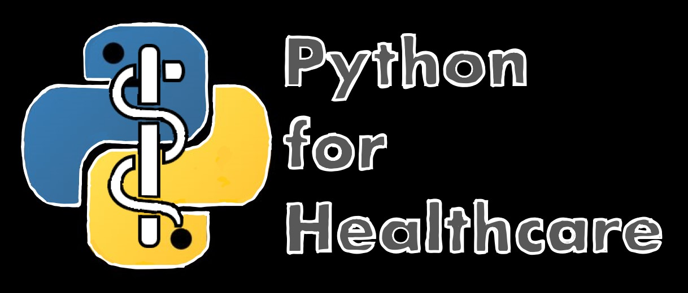

# PyModule 2: How to Write in Python
In this module, we will go over the basics of writing a code script in Python for manipulating data and running statistical tests. 

Learn how to start using the Python Programming Language
- Understand how computer code allows humans to talk to computers
- Learn the concrete process for using computer code and Python
- Identify ways in which you can continue learning how to use Python
Learn how the Python Programming Language can be used in a Healthcare context. 
- Identify questions that can be answered with open source data science tools
- See how Python can be used to answer questions related to healthcare
- Increase awareness of how Python can be used in a future career in healthcare

## Reading
"Teaching Python to Healthcare Workers"

## Videos
How to Write in Python: Part 1
How to Write in Python: Part 2

## Activities
PyModule 2: Lecture & Reading Quiz
PyModule 2: Team Reflections
PyStudio 2: Self-Compose Your Own Script 